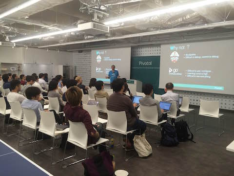

### Concourse Meetup Tokyo #6

https://www.meetup.com/Concourse-CI-Tokyo-Meetup/events/239869851/

## Talk
Native Webhook in Concourse (Etourneau Gwenn, Pivotal Japan)  
 * Slideshare https://www.slideshare.net/gwennetourneau/concourse-webhook
 * Demo https://github.com/shinji62/concourse-demo-meetup-6

Microservices delivery with Concourse, Spring Cloud Contract and CF BG-deployment (Takayuki Kaburagi, Pivotal Japan)     
 * Slideshare https://www.slideshare.net/tkaburagi/microservices-delivery-with-concourse-and-spring-cloud-contract

Selenium Grid from Concourse on Kubernetes (KUOKA Yusuke, ChatWork)
 * Qiita http://qiita.com/mumoshu/items/37d3cb0af66eaf420f9b

#Picture
https://drive.google.com/drive/folders/0B6-cY13f0pq6YzFzYWdtOVFvU3M?usp=sharing

